# Laporan Proyek Machine Learning - Bima Rakajati

## Project Overview

<p align="center">
  
</p>

Sistem rekomendasi telah menjadi elemen penting dalam berbagai platform digital, termasuk layanan streaming anime, yang semakin diminati di era modern. Dengan jumlah judul anime yang terus bertambah, pengguna sering kali mengalami kesulitan dalam menemukan anime yang sesuai dengan preferensi mereka [[1]](https://iopscience.iop.org/article/10.1088/1742-6596/1566/1/012057/meta). Masalah ini semakin relevan selama pandemi COVID-19, ketika layanan streaming dan hiburan daring, termasuk anime, mengalami lonjakan popularitas [[2]](https://northwesternnews.rangerpulse.com/during-coronavirus-pandemic-popularity-of-anime-increases/). Pandemi mendorong banyak orang untuk menghabiskan lebih banyak waktu di rumah, sehingga meningkatkan jumlah pelanggan dan penonton pada platform seperti Netflix, Hulu, Crunchyroll, dan Funimation [[3]](https://www.cnnindonesia.com/hiburan/20210120132336-220-596129/pandemi-2020-buat-netflix-kebanjiran-366-juta-pelanggan-baru).

Kondisi ini menciptakan peluang sekaligus tantangan bagi penyedia layanan untuk menawarkan pengalaman yang lebih personal dan relevan bagi pengguna. Oleh karena itu, proyek ini bertujuan mengembangkan sistem rekomendasi anime yang efektif, guna membantu pengguna menemukan anime yang sesuai dengan selera mereka secara lebih mudah dan cepat. Selain meningkatkan pengalaman pengguna, sistem rekomendasi yang andal juga memiliki potensi untuk meningkatkan retensi pengguna, durasi penggunaan platform, serta pendapatan penyedia layanan [[4]](https://dl.acm.org/doi/10.1145/3097983.3098094).

## Business Understanding

Berdasarkan latar belakang yang telah dijelaskan, kita dapat merumuskan pernyataan masalah sebagai berikut:

### Problem Statements

- Bagaimana cara mengembangkan sistem rekomendasi anime yang dapat merekomendasikan anime berdasarkan genre yang dimiliki anime tersebut?
- Bagaimana cara mengembangkan sistem rekomendasi anime yang dapat merekomendasikan anime berdasarkan preferensi pengguna?

### Goals

Untuk mencapai tujuan bisnis yang telah ditetapkan, proyek ini akan mengupayakan untuk:

- Menghasilkan sistem rekomendasi anime berbasis konten yang dapat merekomendasikan anime berdasarkan genre yang dimiliki anime tersebut.
- Menghasilkan sistem rekomendasi anime berbasis kolaboratif yang dapat merekomendasikan anime berdasarkan preferensi pengguna.

### Solution Approach

Untuk mencapai goals yang telah ditetapkan, proyek ini akan mengimplementasikan dua pendekatan sistem rekomendasi, yaitu:

1. **Content-Based Filtering**: Pendekatan ini merekomendasikan anime berdasarkan kemiripan antara anime yang disukai oleh pengguna dengan anime lainnya. Kemiripan ini dapat diukur berdasarkan genre, studio, rating, dan fitur lainnya.
2. **Collaborative Filtering**: Pendekatan ini merekomendasikan anime berdasarkan kesamaan preferensi pengguna. Sistem ini akan mencari pengguna lain yang memiliki preferensi serupa dengan pengguna yang bersangkutan, lalu merekomendasikan anime yang disukai oleh pengguna lain tersebut.

## Data Understanding

Data yang digunakan dalam proyek ini diambil dari [Anime Recommendations Database](https://www.kaggle.com/datasets/CooperUnion/anime-recommendations-database/data) yang tersedia di Kaggle. Dataset ini terdiri dari dua file utama: `anime.csv` yang berisi informasi tentang berbagai anime, dan `rating.csv` yang berisi rating yang diberikan oleh pengguna untuk setiap anime. Dataset ini berisi informasi tentang preferensi pengguna dari 73.516 pengguna pada 12.294 anime. Setiap pengguna dapat menambahkan anime ke daftar yang telah mereka selesaikan dan memberikan rating, dan dataset ini merupakan kompilasi dari rating tersebut.

### Penjelasan Variabel

Berikut adalah penjelasan dari masing-masing variabel pada kedua dataset tersebut:

| **anime.csv** | **Description** |
| ------------- | --------------- |
| anime_id      | id unik myanimelist.net yang mengidentifikasi sebuah anime. |
| name          | nama lengkap anime. |
| genre         | daftar genre yang dipisahkan dengan koma untuk anime ini. |
| type          | film, TV, OVA, dll. |
| episodes      | berapa banyak episode dalam anime ini. (1 jika film). |
| rating        | rata-rata rating dari 10 untuk anime ini. |
| members       | jumlah anggota komunitas yang ada dalam "grup" anime ini. |

| **rating.csv** | **Description** |
| -------------- | --------------- |
| user_id        | id unik myanimelist.net yang mengidentifikasi seorang pengguna. |
| anime_id       | anime yang telah dinilai oleh pengguna ini. |
| rating         | rating dari 10 yang diberikan pengguna ini (-1 jika pengguna menontonnya tetapi tidak memberikan rating). |

### Informasi Data

Berikut adalah informasi mengenai dataset `anime.csv` dan `rating.csv`:

| Column   | Non-Null Count | Dtype   |
|----------|----------------|---------|
| anime_id | 12294          | int64   |
| name     | 12294          | object  |
| genre    | 12232          | object  |
| type     | 12269          | object  |
| episodes | 12294          | object  |
| rating   | 12064          | float64 |
| members  | 12294          | int64   | 

Pada dataset `anime.csv`, terdapat beberapa kolom yang memiliki tipe data yang berbeda. Kolom `anime_id` dan `members` memiliki tipe data integer, kolom `name`, `genre`,  `type`, dan `episodes` memiliki tipe data object, sedangkan kolom `rating` memiliki tipe data float.

|   Column   | Dtype |
|------------|-------|
| user_id    | int64 |
| anime_id   | int64 |
| rating     | int64 |

Sementara itu, pada dataset `rating.csv`, semua kolom memiliki tipe data integer.

### Statistik Deskriptif

Berikut adalah statistik deskriptif dari dataset `anime.csv` dan `rating.csv`:

| **statistic** | **anime_id** |  **rating**  | **members**  |
|---------------|--------------|--------------|--------------|
| count         | 12294.000000 | 12064.000000 | 1.229400e+04 |
| mean          | 14058.221653 | 6.473902     | 1.807134e+04 |
| std           | 11455.294701 | 1.026746     | 5.482068e+04 |
| min           | 1.000000     | 1.670000     | 5.000000e+00 |
| 25%           | 3484.250000  | 5.880000     | 2.250000e+02 |
| 50%           | 10260.500000 | 6.570000     | 1.550000e+03 |
| 75%           | 24794.500000 | 7.180000     | 9.437000e+03 |
| max           | 34527.000000 | 10.000000    | 1.013917e+06 |

Deskripsi statistik dari dataset `anime.csv` menunjukkan bahwa rata-rata rating anime adalah sebesar 6.47, dengan rating terendah sebesar 1.67 dan rating tertinggi sebesar 10. Sementara itu, anime dengan jumlah anggota terendah memiliki 5 anggota, sedangkan anime dengan jumlah anggota terbanyak memiliki 1.013.917 anggota.

| **statistic** | **user_id**  | **anime_id** |  **rating**   |
|---------------|--------------|--------------|---------------|
| count         | 7.813737e+06 | 7.813737e+06 | 7.813737e+06  |
| mean          | 3.672796e+04 | 8.909072e+03 | 6.144030e+00  |
| std           | 2.099795e+04 | 8.883950e+03 | 3.727800e+00  |
| min           | 1.000000e+00 | 1.000000e+00 | -1.000000e+00 |
| 25%           | 1.897400e+04 | 1.240000e+03 | 6.000000e+00  |
| 50%           | 3.679100e+04 | 6.213000e+03 | 7.000000e+00  |
| 75%           | 5.475700e+04 | 1.409300e+04 | 9.000000e+00  |
| max           | 7.351600e+04 | 3.451900e+04 | 1.000000e+01  |

Deskripsi statistik dari dataset `rating.csv` menunjukkan bahwa rata-rata rating yang diberikan oleh pengguna adalah sebesar 6.14, dengan rating terendah sebesar -1 dan rating tertinggi sebesar 10.

## Exploratory Data Analysis

### Top Anime Berdasarkan Jumlah Anggota

<p align="center">
  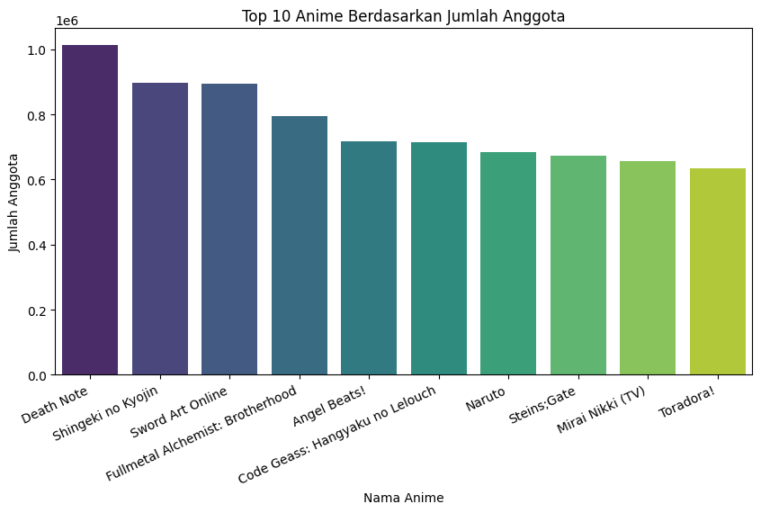
</p>

Dari visualisasi di atas, kita dapat melihat bahwa anime dengan jumlah anggota terbanyak adalah anime yang populer dan memiliki rating yang tinggi. Beberapa anime yang masuk dalam kategori ini antara lain `Death Note`, `Shingeki no Kyojin`, dan `Sword Art Online`.

### Distribusi Rating Anime

<p align="center">
  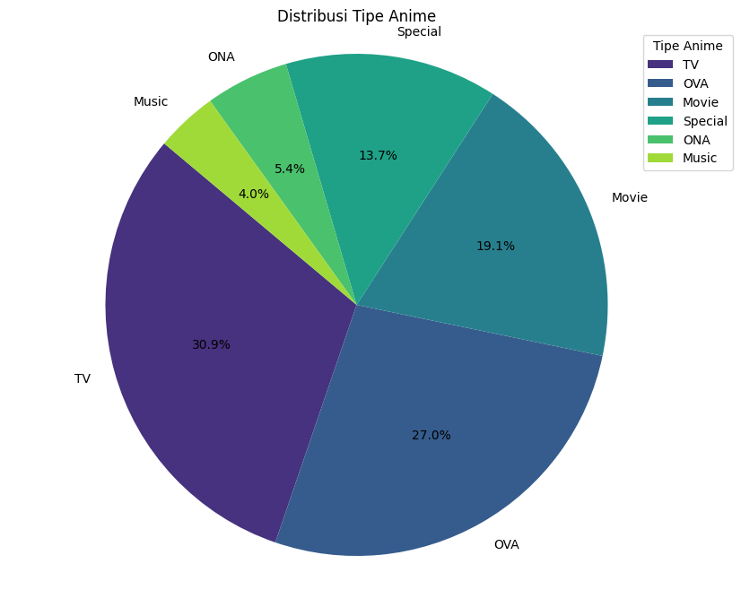
</p>

Dari visualisasi di atas, kita dapat melihat bahwa anime dengan tipe `TV` adalah yang paling banyak, diikuti oleh anime dengan tipe `OVA`, `Movie`, `Special`, `ONA`, dan `Music` sebagai tipe anime yang paling sedikit.

### Distribusi Genre Anime

| **Genre**      | **Count** |
|----------------|-----------|
| Comedy         | 3193      |
| Action         | 2845      |
| Sci-Fi         | 1986      |
| Fantasy        | 1815      |
| Shounen        | 1663      |
| ...            | ...       |
| Police         | 1         |
| Thriller       | 1         |
| Super Power    | 1         |
| Vampire        | 1         |
| Space          | 1         |

Dari tabel di atas, kita dapat melihat bahwa lima data teratas genre anime yang paling banyak adalah `Comedy`, diikuti oleh `Action`, `Sci-Fi`, `Fantasy`, dan `Shounen`. Sementara itu, lima data terbawah genre anime yang paling sedikit adalah `Police`, `Thriller`, `Super Power`, `Vampire`, dan `Space`.

### Distribusi Rating Anime

<p align="center">
  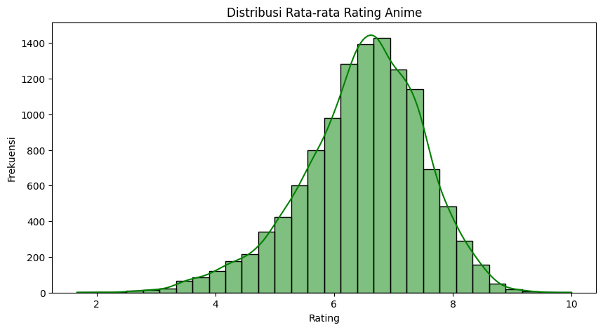
</p>

Dari visualisasi di atas, kita dapat melihat bahwa sebagian besar anime memiliki rating antara `5` hingga `8`. Hal ini menunjukkan bahwa mayoritas anime memiliki rating yang cukup baik, dengan sedikit anime yang memiliki rating sangat rendah atau sangat tinggi. Distribusi ini cenderung **left-skewed**, yang berarti lebih banyak anime yang memiliki rating di atas rata-rata dibandingkan dengan yang memiliki rating di bawah rata-rata. Skewness ini menunjukkan bahwa penonton cenderung memberikan rating yang lebih tinggi untuk anime yang mereka tonton.

### Pengguna dengan Rating Terbanyak
| user_id | rating_count |
|---------|--------------|
| 48766   | 10227        |
| 42635   | 3747         |
| 53698   | 2905         |
| 57620   | 2702         |
| 59643   | 2633         |
| ...     | ...          |
| 11323   | 1            |
| 48775   | 1            |
| 11328   | 1            |
| 48743   | 1            |
| 46734   | 1            |

Dari tabel di atas, kita dapat melihat bahwa pengguna dengan `user_id` **48766** memiliki rating terbanyak, yaitu sebanyak `10.227` rating. Sementara itu, pengguna dengan rating terendah hanya memberikan `1` rating.

### Distribusi Rating Pengguna

<p align="center">
  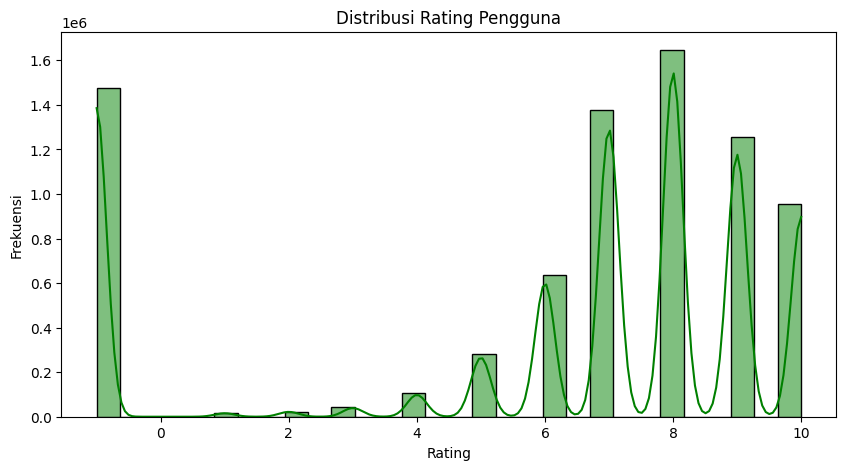
</p>

Dari visualisasi di atas, kita dapat melihat bahwa sebagian besar pengguna memberikan rating antara `6` hingga `10`. Hal ini menunjukkan bahwa mayoritas pengguna memberikan rating yang cukup baik untuk anime yang mereka tonton. Selain itu, terdapat sejumlah pengguna yang memiliki rating `-1`, hal menunjukkan bahwa mereka menonton anime tersebut tetapi tidak memberikan rating. Data rating `-1` ini kemungkinan besar akan dihapus karena tidak memberikan informasi yang berguna dalam pembuatan model rekomendasi.

## Data Preparation

Pada tahap ini, kita akan melakukan beberapa langkah data pre-preparation untuk mempersiapkan data sebelum digunakan dalam pembuatan model rekomendasi. Langkah-langkah pre-preparation yang akan dilakukan antara lain adalah filtering data, handling inrelevant data, dan handling duplicate data.

### Filter Pengguna dengan Rating Sebanyak 500 atau Lebih

Filtering data rating sangat penting dilakukan karena dataset rating memiliki jumlah data yang sangat besar, mencapai jutaan entri. Dengan jumlah data yang sangat besar ini, penggunaan resource komputasi menjadi sangat tinggi dan dapat menyebabkan proses analisis data menjadi tidak efisien. Oleh karena itu, dilakukan filtering data untuk mengurangi jumlah data yang akan diproses. Salah satu cara yang digunakan adalah dengan menyaring pengguna yang memberikan rating sebanyak 500 atau lebih. Dengan melakukan filtering ini, kita dapat mengurangi jumlah data yang harus diproses tanpa mengorbankan kualitas analisis, sehingga penggunaan resource menjadi lebih efisien dan proses analisis data dapat berjalan lebih cepat.

<p align="center">
  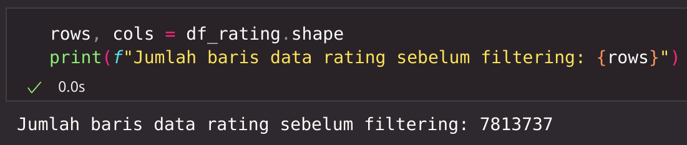
</p>
<p align="center">
  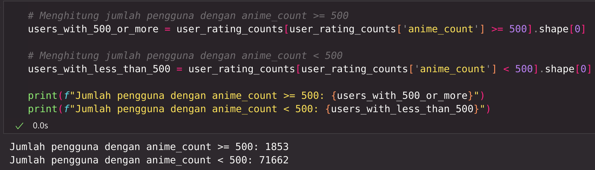
</p>
<p align="center">
  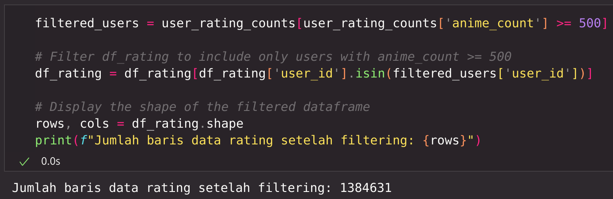
</p>

Dari hasil filtering data ini, terdapat sebanyak **1,853** pengguna yang memberikan rating sebanyak 500 atau lebih. Dengan melakukan filtering ini, kita dapat mengurangi jumlah data yang harus diproses dari **7.813.737** menjadi **1.384.631**.

### Menghapus Data yang Tidak Relevan

Pada dataset `rating.csv`, terdapat beberapa anime yang memiliki rating `-1`. Data ini akan dihapus karena tidak memberikan informasi yang berguna dalam pembuatan model rekomendasi.

| **Rating** | **Jumlah** |
|------------|------------|
| -1         | 289,627    |
| 8          | 281,036    |
| 7          | 280,571    |
| 9          | 162,049    |
| 6          | 151,486    |
| 10         | 99,668     |
| 5          | 71,751     |
| 4          | 26,542     |
| 3          | 11,488     |
| 2          | 6,197      |
| 1          | 4,216      |

Dari tabel di atas, kita dapat melihat bahwa terdapat sebanyak **289.627** rating yang memiliki nilai `-1`. Data ini akan dihapus karena tidak memberikan informasi yang berguna dalam pembuatan model rekomendasi.

### Handling Duplicate Data

<p align="center">
  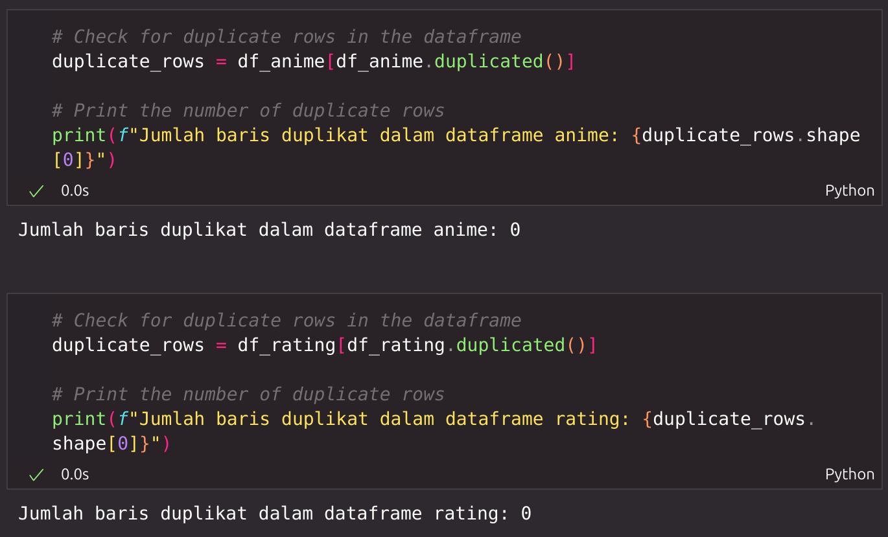
</p>

Pada penanganan data duplikat, terlihat bahwa tidak ada data duplikat yang ditemukan dalam dataset `anime.csv` maupun `rating.csv` setelah dilakukan pengecekan. Oleh karena itu, tidak perlu dilakukan penanganan data duplikat dalam tahap ini.

## Modeling

Pada tahap ini, kita akan membuat model rekomendasi menggunakan metode **Content-Based Filtering** dan **Collaborative Filtering**. Kita akan menggunakan algoritma machine learning `K-Nearest Neighbors (KNN)` untuk membuat model rekomendasi **Content-Based Filtering**, dan algoritma deep learning `RecommenderNet` untuk membuat model rekomendasi **Collaborative Filtering**.

### Content-Based Filtering (K-Nearest Neighbors)

Content-based Filtering adalah metode rekomendasi yang berfokus pada konten dari item yang direkomendasikan. Pada metode ini, rekomendasi diberikan berdasarkan kesamaan antara genre anime yang dipilih dengan genre anime lainnya. Salah satu algoritma yang dapat digunakan dalam Content-based Filtering adalah algoritma `K-Nearest Neighbors (KNN)`.

#### K-Nearest Neighbors (KNN)

K-Nearest Neighbors (KNN) adalah algoritma machine learning yang biasa digunakan untuk klasifikasi dan regresi. Pada konteks Content-Based Filtering, KNN juga dapat digunakan untuk merekomendasikan item berdasarkan kesamaan antara item yang dipilih dengan item lainnya. Algoritma KNN bekerja dengan cara mencari K item terdekat dengan item yang dipilih berdasarkan jarak antara item tersebut. Item-item yang memiliki jarak terdekat dengan item yang dipilih akan direkomendasikan kepada pengguna [[5]](https://lp2m.uma.ac.id/2023/02/16/algoritma-k-nearest-neighbors-knn-pengertian-dan-penerapan/).

Berikut adalah kelebihan dan kekurangan dari Content-Based Filtering menggunakan algoritma KNN:

**Kelebihan:**
1. **Sederhana dan Mudah Dipahami**: KNN adalah algoritma yang sederhana dan mudah dipahami, sehingga mudah diimplementasikan.
2. **Tidak Membutuhkan Asumsi Distribusi Data**: KNN tidak membuat asumsi tentang distribusi data, sehingga dapat digunakan pada berbagai jenis data.
3. **Adaptif terhadap Data Baru**: KNN dapat dengan mudah menyesuaikan dengan data baru tanpa perlu melatih ulang model, karena hanya menyimpan data pelatihan dan menghitung jarak saat prediksi.

**Kekurangan:**
1. **Komputasi yang Mahal**: KNN membutuhkan banyak komputasi, terutama pada dataset besar, karena harus menghitung jarak ke semua titik data pelatihan untuk setiap prediksi.
2. **Memori yang Tinggi**: KNN membutuhkan banyak memori untuk menyimpan seluruh dataset pelatihan, yang dapat menjadi masalah pada dataset besar.
3. **Sensitif terhadap Skala Fitur**: KNN sensitif terhadap skala fitur, sehingga memerlukan normalisasi atau standarisasi data agar fitur dengan skala besar tidak mendominasi perhitungan jarak.
4. **Tidak Efektif pada Data Berdimensi Tinggi**: Kinerja KNN menurun pada data berdimensi tinggi karena fenomena "curse of dimensionality", di mana jarak antar titik data menjadi kurang bermakna.

Sebelum kita melatih model KNN, kita akan menggunakan TF-IDF (Term Frequency-Inverse Document Frequency) untuk mengekstraksi fitur dari data anime. Dalam kasus ini, kita akan menggunakan kolom `genre` dari dataset `anime.csv` sebagai teks yang akan diekstraksi fiturnya.

### TF-IDF (Term Frequency-Inverse Document Frequency)

TF-IDF adalah metode yang digunakan untuk mengekstraksi fitur dari teks dengan memberikan bobot pada kata-kata yang muncul dalam teks. TF-IDF terdiri dari dua komponen utama: Term Frequency (TF) dan Inverse Document Frequency (IDF) [[6]](https://www.semrush.com/blog/tf-idf/).

#### Term Frequency (TF)
Term Frequency mengukur seberapa sering sebuah kata muncul dalam sebuah dokumen. Rumusnya adalah:

$$ \text{TF}(t, d) = \frac{f_{t,d}}{N_d} $$

di mana:
- $f_{t,d}$ adalah frekuensi kata $t$ dalam dokumen $d$.
- $N_d$ adalah total jumlah kata dalam dokumen $d$.

#### Inverse Document Frequency (IDF)
Inverse Document Frequency mengukur seberapa penting sebuah kata dalam keseluruhan korpus. Rumusnya adalah:

$$ \text{IDF}(t, D) = \log \left( \frac{N}{1 + | \{ d \in D : t \in d \} |} \right) $$

di mana:
- $N$ adalah total jumlah dokumen dalam korpus.
- $| \{ d \in D : t \in d \} |$ adalah jumlah dokumen yang mengandung kata $t$.

#### TF-IDF
TF-IDF adalah hasil perkalian antara TF dan IDF. Rumusnya adalah:

$$ \text{TF-IDF}(t, d, D) = \text{TF}(t, d) \times \text{IDF}(t, D) $$

Dengan menggunakan TF-IDF, kita dapat memberikan bobot yang lebih tinggi pada kata-kata yang sering muncul dalam dokumen tertentu tetapi jarang muncul dalam dokumen lain, sehingga lebih mencerminkan pentingnya kata tersebut dalam konteks dokumen tertentu.

#### Pelatihan Model KNN

Setelah kita mengekstraksi fitur menggunakan TF-IDF, kita dapat melatih model KNN untuk merekomendasikan anime berdasarkan genre anime yang dipilih.

```python
knn_model = NearestNeighbors(metric='cosine', algorithm='brute')
```

Pada parameter `metric`, kita akan menggunakan `cosine` untuk mengukur kesamaan antara item, dan pada parameter `algorithm`, kita akan menggunakan `brute` untuk menghitung jarak antara item.

#### Hasil Rekomendasi

Setelah model KNN dilatih, kita dapat menggunakan model tersebut untuk merekomendasikan anime berdasarkan genre anime yang dipilih. Berikut adalah contoh hasil rekomendasi untuk anime dengan genre `Adventure, Sci-Fi, Supernatural`:

<p align="center">
  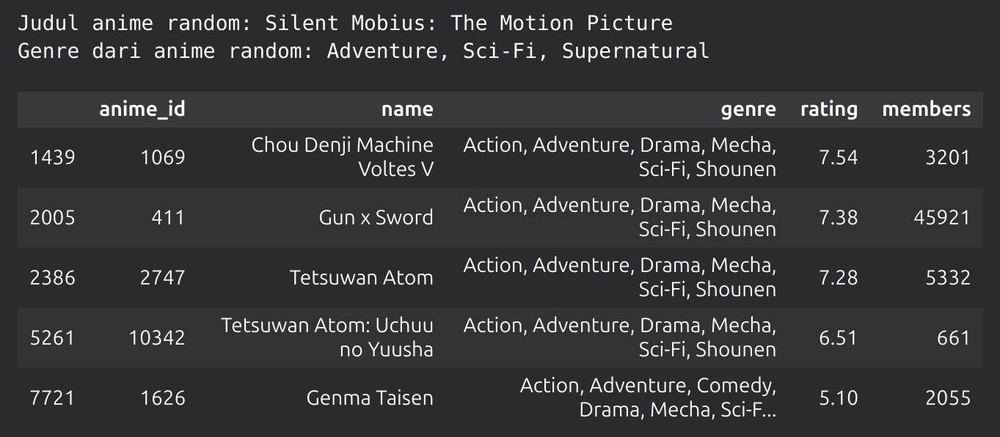
</p>

Dari hasil rekomendasi, kita dapat melihat bahwa anime yang direkomendasikan memiliki genre yang mirip dengan anime random yang terpilih. Hal ini menunjukkan bahwa model rekomendasi Content-based Filtering menggunakan algoritma K-Nearest Neighbors (KNN) telah berhasil memberikan rekomendasi yang sesuai dengan preferensi pengguna.

### Collaborative Filtering (RecommenderNet)

Collaborative Filtering adalah metode rekomendasi yang berfokus pada kesamaan preferensi pengguna. Pada metode ini, rekomendasi diberikan berdasarkan kesamaan preferensi pengguna dengan pengguna lainnya. Salah satu algoritma yang dapat digunakan dalam Collaborative Filtering adalah algoritma deep learning `RecommenderNet`.

#### RecommenderNet

Di sini, kita akan membuat class RecommenderNet menggunakan class Model dari Keras. Kode class RecommenderNet ini diadaptasi dari tutorial di situs Keras [[7]](https://keras.io/examples/structured_data/collaborative_filtering_movielens/) dengan beberapa penyesuaian untuk kasus yang sedang kita selesaikan.

#### Encoding Data

Selanjutnya kita akan menyandikan (encode) data user_id dan anime_id ke dalam indeks integer. Selain itu, kita juga akan mencari data rating terendah dan tertinggi yang akan digunakan dalam proses splitting data nanti. Berikut adalah hasil encoding data user_id dan anime_id, dan dataframe yang berisi data jumlah pengguna, anime, dan rating terendah dan tertinggi:

<p align="center">
  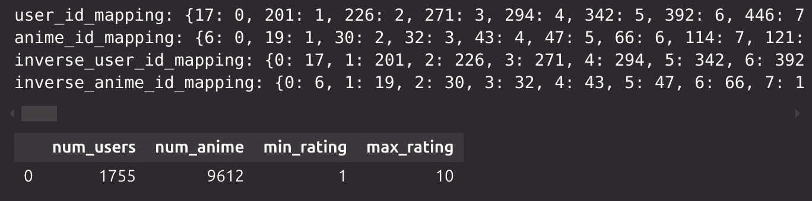
</p>

#### Split Data

Lalu, kita akan membagi data menjadi data training dan data testing dengan rasio 70:30. Data training akan digunakan untuk melatih model, sedangkan data testing akan digunakan untuk mengevaluasi model.

<p align="center">
  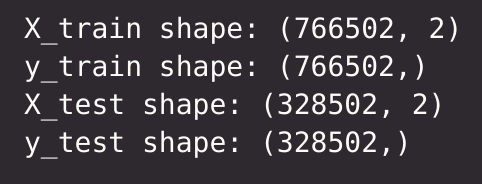
</p>

#### Pelatihan Model RecommenderNet

Setelah itu, kita akan membuat model Collaborative Filtering menggunakan class RecommenderNet yang telah kita buat sebelumnya. Model ini akan dilatih menggunakan data training yang telah kita bagi sebelumnya.

Dalam proses training, kita akan menggunakan `Adam` sebagai optimizer, `mean_squared_error` sebagai loss function, dan `mean_absolute_error` sebagai metrics. Selain itu, kita juga akan menggunakan `EarlyStopping` untuk menghentikan proses training jika tidak terjadi peningkatan performa model.

<p align="center">
  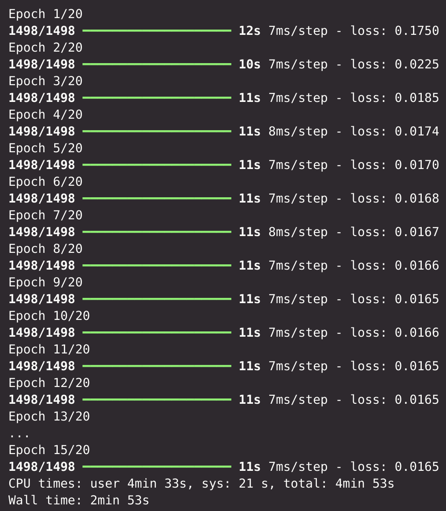
</p>

Dari output di atas, pelatihan model berhenti setelah `15` epoch dengan nilai mean squared error terendah sebesar `0.0165` dan nilai mean absolute error sebesar `0.0969`

#### Hasil Rekomendasi

Setelah model Collaborative Filtering dilatih, kita dapat menggunakan model tersebut untuk merekomendasikan anime berdasarkan preferensi pengguna. Berikut adalah contoh hasil rekomendasi untuk pengguna random yang dipilih dari hasil encoding data sebelumnya:

<p align="center">
  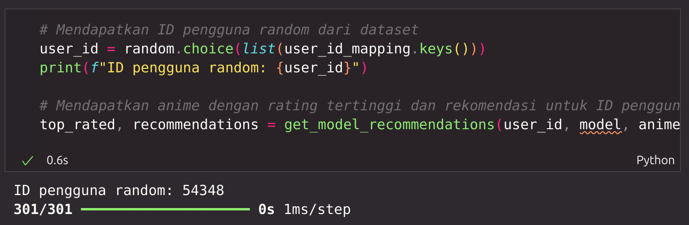
</p>

Hasil dari pengguna random yang dipilih adalah sebagai berikut:

**Anime dengan rating tertinggi dari User 54348:**

  | anime_id | name               | genre                                   | rating | members |
  |----------|--------------------|-----------------------------------------|--------|---------|
  | 6547     | Angel Beats!       | Action, Comedy, Drama, School, Supernatural | 8.39   | 717796  |
  | 2034     | Lovely★Complex     | Comedy, Romance, Shoujo                 | 8.23   | 235003  |
  | 15       | Eyeshield 21       | Action, Comedy, Shounen, Sports         | 8.08   | 83648   |
  | 2927     | Kimikiss Pure Rouge| Drama, Romance, School                  | 7.48   | 58211   |
  | 5150     | Hatsukoi Limited   | Comedy, Romance, School, Shounen        | 7.45   | 54796   |

**Rekomendasi anime untuk User 54348:**

| anime_id | name                              | genre                                                   | rating | members |
|----------|-----------------------------------|---------------------------------------------------------|--------|---------|
| 32281    | Kimi no Na wa.                    | Drama, Romance, School, Supernatural                    | 9.37   | 200630  |
| 5114     | Fullmetal Alchemist: Brotherhood  | Action, Adventure, Drama, Fantasy, Magic, Military      | 9.26   | 793665  |
| 28977    | Gintama°                          | Action, Comedy, Historical, Parody, Samurai, Sci-Fi     | 9.25   | 114262  |
| 9969     | Gintama'                          | Action, Comedy, Historical, Parody, Samurai, Sci-Fi     | 9.16   | 151266  |
| 820      | Ginga Eiyuu Densetsu              | Drama, Military, Sci-Fi, Space                          | 9.11   | 80679   |

Dari hasil rekomendasi Collaborative Filtering, kita dapat melihat bahwa anime yang direkomendasikan memiliki rating yang tinggi dan sesuai dengan preferensi pengguna. Selain itu, genre dari anime yang direkomendasikan juga memiliki kemiripan dengan genre anime yang telah ditonton oleh pengguna. Hal ini menunjukkan bahwa model Collaborative Filtering yang telah kita buat telah berhasil memberikan rekomendasi yang sesuai dengan preferensi pengguna.

## Evaluation

Pada tahap evaluasi, kita akan menggunakan metrik evaluasi yang sesuai dengan konteks data dan solusi yang telah kita buat. Metrik evaluasi yang akan digunakan dalam proyek ini adalah `Mean Squared Error (MSE)` dan `Mean Absolute Error (MAE)`.

### Mean Squared Error (MSE)

Mean Squared Error (MSE) adalah salah satu metode evaluasi yang umum digunakan dalam data science. MSE menghitung rata-rata dari selisih kuadrat antara nilai prediksi dan nilai aktual.

Dengan kata lain, MSE menghitung berapa rata-rata kesalahan kuadrat dalam prediksi. Semakin kecil nilai MSE, semakin baik kualitas model tersebut [[8]](https://www.trivusi.web.id/2023/03/perbedaan-mae-mse-rmse-dan-mape.html).

Rumus dari MSE adalah:

$$ \text{MSE} = \frac{1}{n} \sum_{i=1}^{n} (y_i - \hat{y}_i)^2 $$

di mana:
- $n$ adalah jumlah data.
- $y_i$ adalah nilai sebenarnya.
- $\hat{y}_i$ adalah nilai prediksi.

### Mean Absolute Error (MAE)

Mean Absolute Error (MAE) adalah metode evaluasi lain yang digunakan dalam data science. MAE menghitung rata-rata dari selisih absolut antara nilai prediksi dan nilai aktual.

Dengan kata lain, MAE menghitung berapa rata-rata kesalahan absolut dalam prediksi. Semakin kecil nilai MAE, semakin baik kualitas model tersebut [[8]](https://www.trivusi.web.id/2023/03/perbedaan-mae-mse-rmse-dan-mape.html).

Rumus dari MAE adalah:

$$ \text{MAE} = \frac{1}{n} \sum_{i=1}^{n} |y_i - \hat{y}_i| $$

di mana:
- $n$ adalah jumlah data.
- $y_i$ adalah nilai sebenarnya.
- $\hat{y}_i$ adalah nilai prediksi.

### Hasil Evaluasi

<p align="center">
  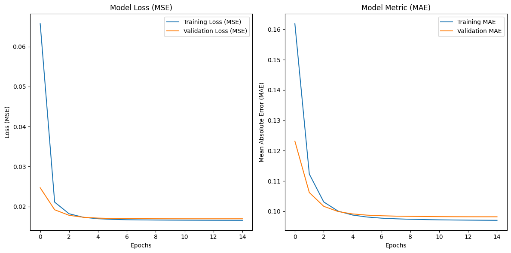
</p>

Dari hasil evaluasi Collaborative Filtering menggunakan metrik MSE dan MAE, kita dapat melihat bahwa nilai MSE sebesar `0.0165` dan nilai MAE sebesar `0.0969`. Nilai MSE dan MAE yang rendah menunjukkan bahwa model Collaborative Filtering yang telah kita buat memiliki performa yang baik dalam merekomendasikan anime berdasarkan preferensi pengguna.

# Kesimpulan

Dalam proyek ini, kita telah berhasil mengembangkan sistem rekomendasi anime menggunakan dua pendekatan, yaitu Content-Based Filtering dan Collaborative Filtering. Pada pendekatan Content-Based Filtering, kita menggunakan algoritma K-Nearest Neighbors (KNN) untuk merekomendasikan anime berdasarkan genre anime yang dipilih. Sedangkan pada pendekatan Collaborative Filtering, kita menggunakan algoritma deep learning RecommenderNet untuk merekomendasikan anime berdasarkan preferensi pengguna.

Dari hasil evaluasi, kita dapat melihat bahwa model Collaborative Filtering memiliki performa yang baik dalam merekomendasikan anime berdasarkan preferensi pengguna. Nilai MSE dan MAE yang rendah menunjukkan bahwa model Collaborative Filtering mampu memberikan rekomendasi yang sesuai dengan preferensi pengguna.

Dengan demikian, sistem rekomendasi anime yang telah kita kembangkan dapat membantu pengguna menemukan anime yang sesuai dengan preferensi mereka dengan lebih mudah dan cepat.

# Referensi

[1] A S Girsang, B Al Faruq, H R Herlianto and S Simbolon. (2020)."*Collaborative Recommendation System in Users of Anime Films*". IOP Science. https://iopscience.iop.org/article/10.1088/1742-6596/1566/1/012057/meta

[2] D Thornton. (2021). "*During coronavirus pandemic, popularity of anime increases*". Northwestern News. https://news.northwestern.edu/stories/2021/03/during-coronavirus-pandemic-popularity-of-anime-increases/

[3] CNN Indonesia. (2021). "*Pandemi 2020 Buat Netflix Kebanjiran 36,6 Juta Pelanggan Baru*". CNN Indonesia. https://www.cnnindonesia.com/hiburan/20210120132336-220-596129/pandemi-2020-buat-netflix-kebanjiran-366-juta-pelanggan-baru

[4] C Yang, L Bai, C Zhang, Q Yuan, J Han. (2017). "*Bridging Collaborative Filtering and Semi-Supervised Learning: A Neural Approach for POI Recommendation*". ACM Digital Library. https://dl.acm.org/doi/10.1145/3097983.3098094

[5] LP2M. (2023). "*Algoritma K-Nearest Neighbors (KNN) – Pengertian dan Penerapan*". LP2M UMA. https://lp2m.uma.ac.id/2023/02/16/algoritma-k-nearest-neighbors-knn-pengertian-dan-penerapan/

[6] B Mustapic. (2024). "*An Introduction to TF-IDF: What It Is & How to Use It*". Semrush Blog. https://www.semrush.com/blog/tf-idf/

[7] S Banerjee. (2020). "*Collaborative Filtering for Movie Recommendations*". Keras. https://keras.io/examples/structured_data/collaborative_filtering_movielens/

[8] Trivusi. (2023). "*Perbedaan MAE, MSE, RMSE, dan MAPE pada Data Science*". Trivusi. https://www.trivusi.web.id/2023/03/perbedaan-mae-mse-rmse-dan-mape.html
